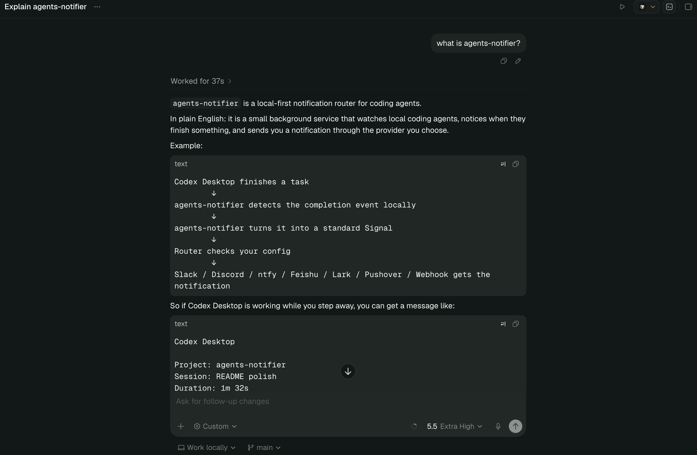
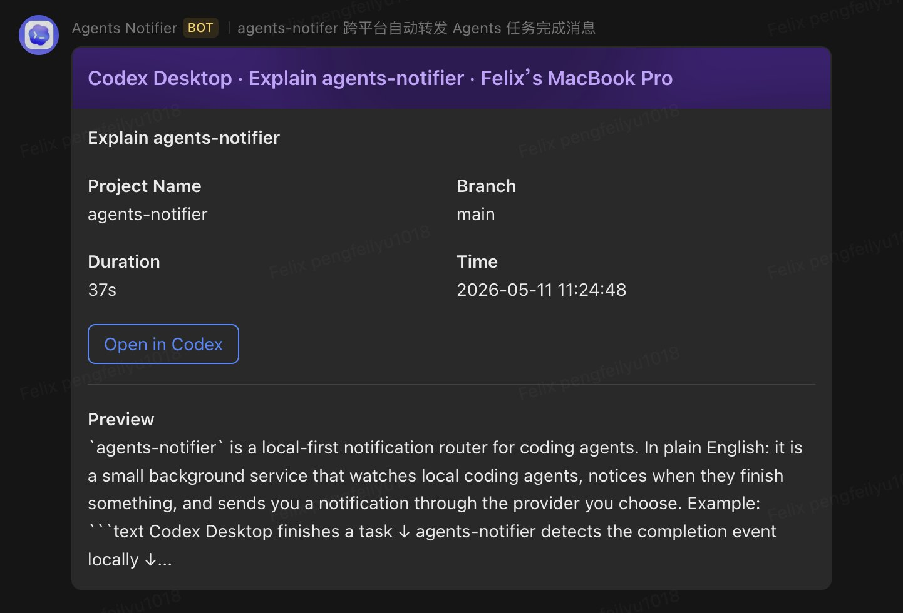
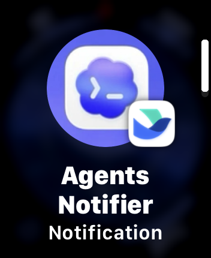
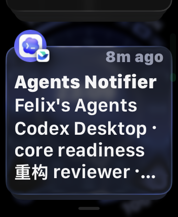

# agents-router

Set it up in 2-3 minutes and get local coding agent updates on your phone, Slack, Discord, Telegram, WhatsApp, WeChat, Microsoft Teams, email, Feishu/Lark, Pushover, or webhook.

---

中文文档：[docs/README.zh-CN.md](docs/README.zh-CN.md)

[Quick start](#quick-start)

> _"Imagine [Codex Desktop App](https://openai.com/codex/) keeps working while you make coffee or do laundry._
>
> _The moment the job finishes, you get a notification and know it is time to come back."_

⚡ Local-first signal routing for AI coding agents.

Built for local agents like [Codex Desktop](https://openai.com/codex/), [Codex CLI](https://github.com/openai/codex), [Claude Code](https://claude.com/product/claude-code), GitHub Copilot CLI, Gemini CLI, Aider, Cursor CLI, OpenCode CLI, OpenClaw, and Hermes Agent CLI.

Built in Rust 🦀. Fast, small, and quiet in the background.

```text
Agent on your computer -> Agents Router -> Your provider
```

No cloud account. No hosted backend. No extra dashboard.

## ✅ Support

Agents:

- [Codex Desktop](https://openai.com/codex/) on macOS and Windows
- [Codex CLI](https://github.com/openai/codex) through hooks on macOS, Linux, and Windows
- [Claude Code](https://claude.com/product/claude-code) through hooks on macOS, Linux, and Windows
- [GitHub Copilot CLI](https://docs.github.com/copilot/reference/cli-command-reference) through hooks on macOS, Linux, and Windows
- [Gemini CLI](https://google-gemini.github.io/gemini-cli/) through hooks on macOS, Linux, and Windows
- [Aider](https://aider.chat/) through notification commands on macOS, Linux, and Windows
- [Cursor CLI](https://docs.cursor.com/en/cli/overview) through a completion wrapper on macOS, Linux, and Windows
- [OpenCode CLI](https://opencode.ai/) through plugins on macOS, Linux, and Windows
- [OpenClaw](https://docs.openclaw.ai/) through plugin hooks on macOS, Linux, and Windows
- [Hermes Agent CLI](https://hermes-agent.nousresearch.com/docs/user-guide/features/hooks) through plugin hooks on macOS, Linux, and Windows

Providers (Where do you want to get the notification?):

- [ntfy](https://ntfy.sh/)
- [Slack](https://docs.slack.dev/messaging/sending-messages-using-incoming-webhooks/)
- [Discord](https://docs.discord.com/developers/resources/webhook)
- [Telegram](https://core.telegram.org/bots/api)
- [WhatsApp](https://developers.facebook.com/docs/whatsapp)
- WeChat personal chat through iLink
- [Microsoft Teams](https://learn.microsoft.com/en-us/microsoftteams/platform/webhooks-and-connectors/how-to/add-incoming-webhook)
- [Email SMTP](https://www.rfc-editor.org/rfc/rfc6409)
- Feishu/Lark Custom Bot ([Feishu](https://open.feishu.cn/document/client-docs/bot-v3/add-custom-bot), [Lark](https://open.larksuite.com/document/client-docs/bot-v3/add-custom-bot))
- [Pushover](https://pushover.net/api)
- Webhook

## 🔒 Privacy

Agents Router runs locally.

Your data does not go to an Agents Router cloud.

Notifications go directly from your computer to your provider.

For Codex Desktop, it reads only completion data needed for the notification:

- project
- project path
- session
- Codex thread link
- duration
- branch
- time
- final answer preview by default, or full answer when enabled
- prompt only when explicitly enabled
- computer name

In Feishu/Lark, notifications are sent as Codex-colored interactive cards with a clickable Open in Codex button.
The button opens a local browser URL first, then hands off to Codex Desktop.

<a id="quick-start"></a>

## ⚙️ Install - Step 1

Pick one install method. That is enough.

Recommended:

Copy this into your Terminal:

```bash
npx --yes --prefer-online agents-router@latest setup
```

Prefer a persistent npm install:

```bash
npm install -g agents-router
agents-router setup
```

Without Node.js/npm:

```bash
curl -fsSL https://raw.githubusercontent.com/lumpinif/agents-router/main/install.sh | sh
agents-router setup
```

Windows PowerShell:

```powershell
irm https://raw.githubusercontent.com/lumpinif/agents-router/main/install.ps1 | iex
agents-router setup
```

To upgrade later, rerun the same install method you used the first time. If the
local service is already running, the installer restarts it after replacing the
binary so the background service uses the new version too.

From source:

```bash
git clone https://github.com/lumpinif/agents-router.git
cd agents-router
cargo install --path .
agents-router setup
```

## 🚀 Setup - Step 2

```bash
agents-router setup
```

First choose the CLI language. English is the default, and Simplified Chinese is available.

Then setup asks for three choices:

1. Which agent should it watch?
2. Where should notifications go?
3. Which completed tasks should send notifications?

Then it writes config, starts the service, and sends a test notification.

For optional settings such as answer detail, prompt inclusion, and advanced project filters, see [Setup](docs/setup.md).

## 🎉 That's it

The service runs locally:

- macOS: LaunchAgent
- Linux: systemd user service
- Windows: Task Scheduler

To stop using the service, run `agents-router stop`.

Provider setup guides:

- [Feishu/Lark Custom Bot](docs/providers/feishu-lark-custom-bot.md)
- [ntfy](docs/providers/ntfy.md)
- [Pushover](docs/providers/pushover.md)
- [Slack](docs/providers/slack.md)
- [Discord](docs/providers/discord.md)
- [Telegram](docs/providers/telegram.md)
- [WhatsApp](docs/providers/whatsapp.md)
- [WeChat](docs/providers/wechat.md)
- [Microsoft Teams](docs/providers/microsoft-teams.md)
- [Email SMTP](docs/providers/email-smtp.md)
- [Webhook](docs/providers/webhook.md)

Agent setup guides:

- [Codex CLI](docs/agents/codex-cli.md)
- [Claude Code](docs/agents/claude-code.md)
- [GitHub Copilot CLI](docs/agents/github-copilot-cli.md)
- [Gemini CLI](docs/agents/gemini-cli.md)
- [Aider](docs/agents/aider.md)
- [Cursor CLI](docs/agents/cursor-cli.md)
- [OpenCode CLI](docs/agents/opencode-cli.md)
- [OpenClaw](docs/agents/openclaw.md)
- [Hermes Agent CLI](docs/agents/hermes-agent-cli.md)

## 🧹 Uninstall

Remove Agents Router cleanly:

```bash
npx --yes agents-router uninstall
```

If you installed it globally with npm, remove the npm package after local cleanup:

```bash
agents-router uninstall
npm uninstall -g agents-router
```

## 🧭 Commands

```bash
agents-router setup    # set up or change agent/provider
agents-router start    # start existing service
agents-router status   # check service status
agents-router stop     # stop service
agents-router uninstall # remove service, config, logs, and state
agents-router watch    # foreground debug worker
```

CLI agent hooks can submit events with:

```bash
agents-router emit \
  --source codex_cli \
  --title "Codex" \
  --body "Ready for review."
```

```bash
agents-router emit \
  --source claude_code \
  --title "Claude Code" \
  --body "Claude Code finished a task."
```

```bash
agents-router emit \
  --source opencode_cli \
  --title "OpenCode CLI" \
  --body "OpenCode CLI finished a task."
```

```bash
agents-router emit \
  --source gemini_cli \
  --title "Gemini CLI" \
  --body "Gemini CLI finished a task."
```

`emit` only talks to the local service. Providers are sent by the service.

## ✨ Example

Codex Desktop + Lark integration, including Apple Watch push notifications.

| Original source: Codex Desktop | Lark desktop notification |
| --- | --- |
|  |  |

| Lark push preview | Apple Watch notification |
| --- | --- |
|  |  |

```text
Codex Desktop

Project: agents-router
Session: README polish
Open in Codex: codex://threads/019e1049-2d6d-7de2-bcdf-f47346930b71
Duration: 1m 32s
Branch: main
Time: 2026-05-10 01:35:42 +08:00

Preview: Updated the README with a clearer setup flow...
```

## 📝 Config

```text
~/.config/agents-router/config.toml
```

Most users should use `agents-router setup`.
The running service automatically reloads valid config changes.

## 🧩 Core

```text
Source -> Signal -> Router -> Provider
```

Simple core. More agents and providers over time.

Contributions welcome. 💛
